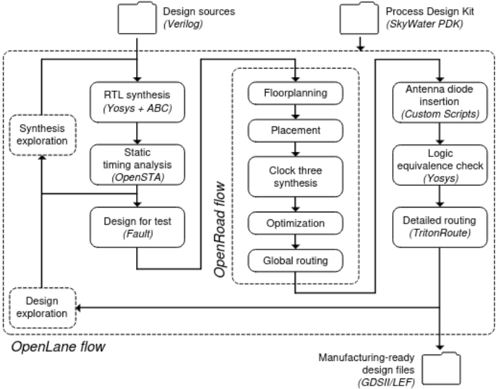
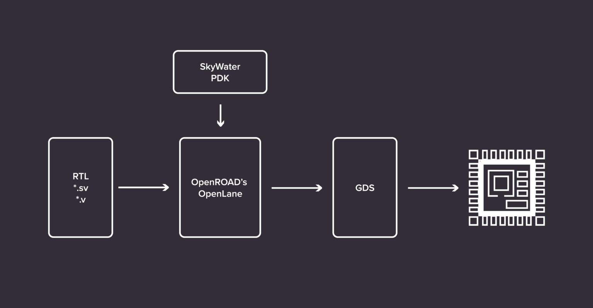
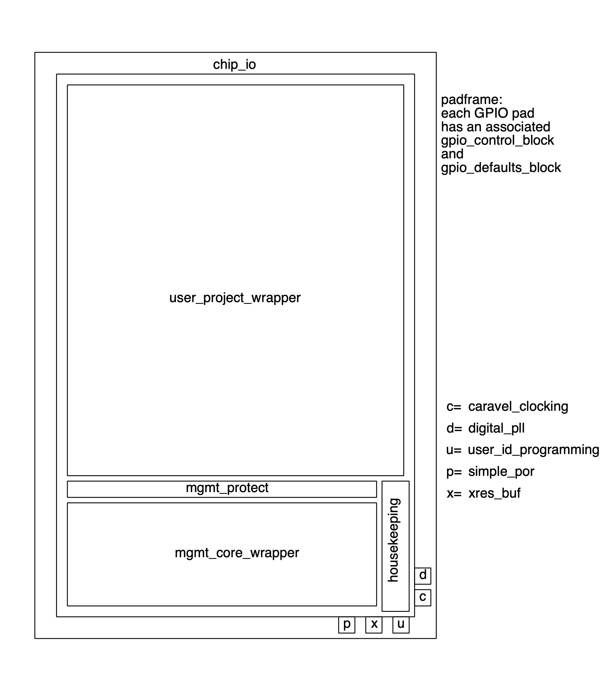

# Proposal 

## Project Overview

LibreCar Control aims to democratise knowledge to control an an automotive vehicle.

Nlnet funded development of Librecar Control in 2023 round.

* [[Archeivements]] - details of outcome project archeived in 2023.

...

## 2024 Project Plans

The next natural step is to make CAN-Bus IP ready for ASIC integration. All opensource tools are intended to be used to archeive this goal. 

The recent introduction of open source PDKs like 130nm BiCMOS process from IHP, the SOI-CMOS PDK from Minimal Fab, 130nm mixed-signal CMOS SKY130 from Skywater and GlobalFoundries' 180nm has opened several opportunities for circuit designers. The conventional PDKs from TSMC, UMC etc. are quite expensive and involve strict licensing process, making them difficult to access for all. OpenPDK has removed the roadblocks for ASIC designing, providing access to make custom chips for free initially for faster development cycle or at very low-cost eventually.

This project aims to archeive the functionality of fully open source CAN-Bus digital IP to be built into an ASIC using Skywater 130nm Open PDK which is already synthesized and proven in FPGA as part of NLNET 2023 funding.

### Project Objectives

* First open source CAN-Bus IP with 1 Mb/s capabilities.
* Use, for the first time, an open source PDK, skywater 130 nm, for the realization of CAN Controller.
* To illustrate the importance of open source hardware and synthesizable design techniques, motivating their adoption in circuit design.

### Target Consumers

The project attempts to help solve the need for open source Hardware.

Open source hardware refers to a hardware, an ASIC, or even, a circuit that has provided access to its entire design, specifications, and documentations, which can be used, altered, or distributed by anyone. 

Like source code in case of open source software, all the schematics, logic designs, layout-data, and netlists need to be made available for revisions by anyone, who has access to the tools to read, manipulate and update the existing design with new features, usually aiming for better performance and share the improved design back to the community for further enhancements/evaluations.

This effort will help the opensource community in folowwing ways:

- Access to an opensource CAN-Bus IP in ans ASIC and its entire design, specifications, and documentations. 
- Knowledge how to integrate any FPGA based design to an opensource ASIC with access to all logic designs, layout-data, and netlists.
- Access to Schematic and Board Design for communicating with autmotive and industrial deveices.
- Enables software developers to effectively optimize their source codes based on fully accessible hardware details of CAN-Bus IP.

...

### Overview

- **Total Estimated Duration:** Duration of the whole project (e.g. 12 months)

- **Total Costs:** Requested amount in Euro for the whole project is 50,000 Euros. 

> :: For hardware development, we needed for a long time to rely on commercial tools to simulate circuits and synthesize them targeting FPGAs or ASICs. FPGA tools from Intel (former Altera) and AMD (former Xilinx) are expensive and impossible to tinker with them as they are closed-source. For ASIC designs, we needed to use commercial tools, which are pretty expensive.

**Only opensource tools and methodology is planned to be used in development of this project**.

For this project, we rely on below opensoource tools:

* Yosys, an open source framework for RTL synthesis. 
* OpenROAD, which is used in OpenLane, delivers an end-to-end silicon compiler in open source, providing an automated layout generation flow from a design in RTLto GDSII/LEF files used to produce silicon chips.

* The SkyWater PDK is a catalog of standard logic cells that are designed for manufacturing at the SkyWater fab.

* Caravel project provides an already hardened harness which has a blank space of 2.920 µm × 3.520 µm left for a custom design. The harness includes a small RISC-V management core, clock management, digital IO pins, logic analyzer pins, and a Wishbone interface from the RISC-V core to the user design.

