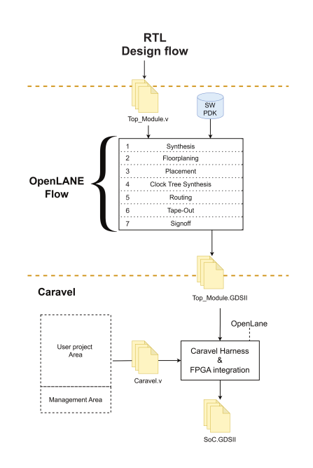

# Roadmap

Below we provide the **project roadmap**. 

The workflow followed to develop the current SoC template with CAN IP is divided into 3 steps.
* The RTL design flow
* The OpenLANE flow 
* The Caravel integration

The whole process is illustrated in below workflow:

...

## Milestone 1 — RTL design flow

- **Estimated duration:** 4 months
- **Costs:** 5,000 Euros

...

## Milestone 2 — OpenLANE flow 

- **Estimated Duration:** 4 months
- **Costs:** 15,000 Euros

...

## Milestone 3 — Caravel integration

- **Estimated Duration:** 4 months
- **Costs:** 20,000 Euros

...

## Milestone 4 — Chip fabrication

- **Estimated Duration:** 4 months
- **Costs:** 10,000 Euros

...